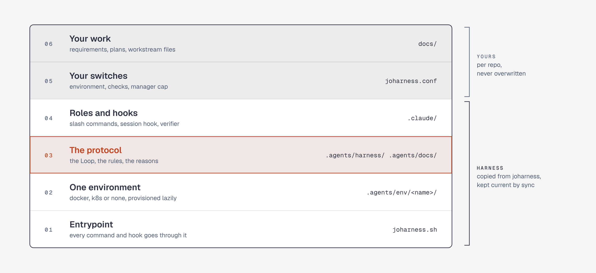
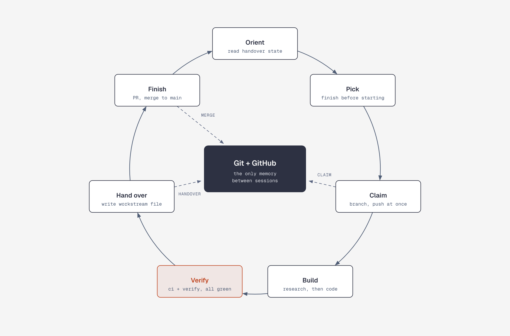
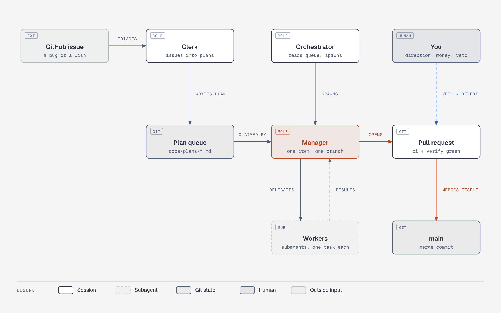
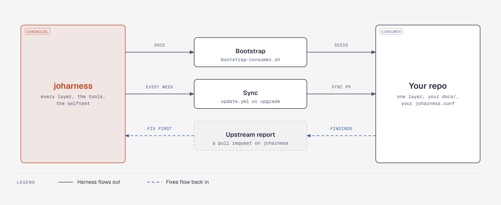

# joharness

Harness for long-running Claude Code work: sessions claim items from a queue,
build them on their own branch, hand over through git, and merge their own
pull requests. This repo is the canonical copy; consumer repos sync from it.



## How it works





The rules are in [`.agents/harness/AGENTS.md`](.agents/harness/AGENTS.md).
How the roles run, and the bounds on them:
[`.agents/docs/orchestrated.md`](.agents/docs/orchestrated.md).

## Usage

```bash
./joharness.sh help       # commands, config keys
./joharness.sh ci         # checks
./joharness.sh verify     # provision + smoke test
./joharness.sh dispatch   # queue, sessions in flight
```

## Add to a repo



```bash
git clone https://github.com/chrsctl/joharness.git
joharness/.agents/scripts/bootstrap-consumer.sh --env docker ../my-project
```

Then follow the steps it prints. To update, merge the weekly `update.yml` PR
or run `./joharness.sh upgrade`. Details:
[`.agents/docs/consumer-repos.md`](.agents/docs/consumer-repos.md).

## License

MIT. Diagrams: [diagram-design](https://github.com/cathrynlavery/diagram-design),
sources in [`docs/readme/`](docs/readme/).
