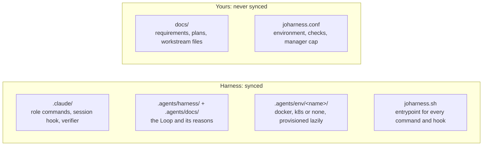
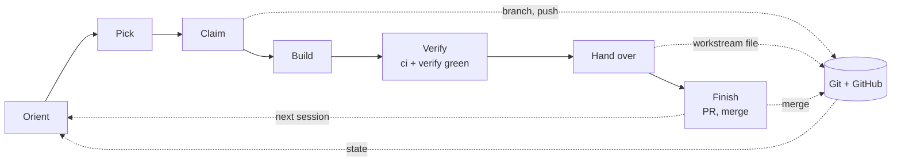
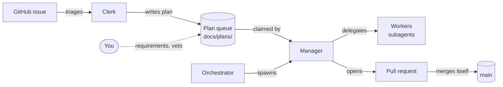
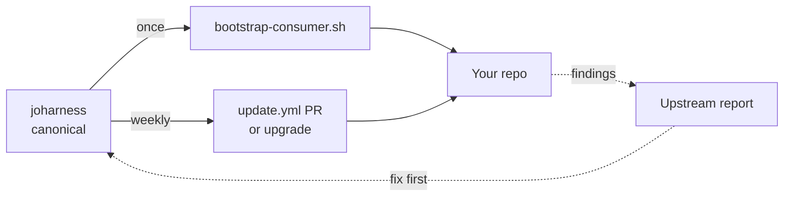

# joharness

Harness for long-running Claude Code work: sessions claim items from a queue,
build them on their own branch, hand over through git, and merge their own
pull requests. This repo is the canonical copy; consumer repos sync from it.



## How it works

Each session takes one item through the Loop in
[`.agents/harness/AGENTS.md`](.agents/harness/AGENTS.md):



How work moves through the roles. The bounds are in
[`.agents/docs/orchestrated.md`](.agents/docs/orchestrated.md):



## Usage

```bash
./joharness.sh help       # commands, config keys
./joharness.sh ci         # checks
./joharness.sh verify     # provision + smoke test
./joharness.sh dispatch   # queue, sessions in flight
```

## Add to a repo



```bash
git clone https://github.com/chrsctl/joharness.git
joharness/.agents/scripts/bootstrap-consumer.sh --env docker ../my-project
```

Then follow the steps it prints. To update, merge the weekly `update.yml` PR
or run `./joharness.sh upgrade`. Details:
[`.agents/docs/consumer-repos.md`](.agents/docs/consumer-repos.md).

## License

MIT.
